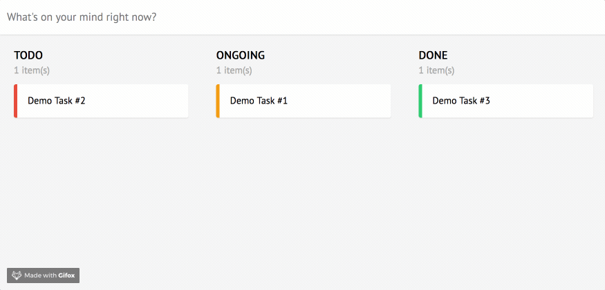

# Kanelm - Kanban Board in Elm



## Run it locally

Assume you already have Node and Elm installed, you can use either NPM or Yarn.

1. Clone this project
2. Install dependencies:
  ```
  npm install
  elm-package install
  ```
3. Start the dev server:
  ```
  npm start
  ```

## Deploy it on your server

To deploy it on your server, just run `npm build` and copy the two files in `dist` folder. It run as a static HTML page, so you can even put it on Github Pages.
